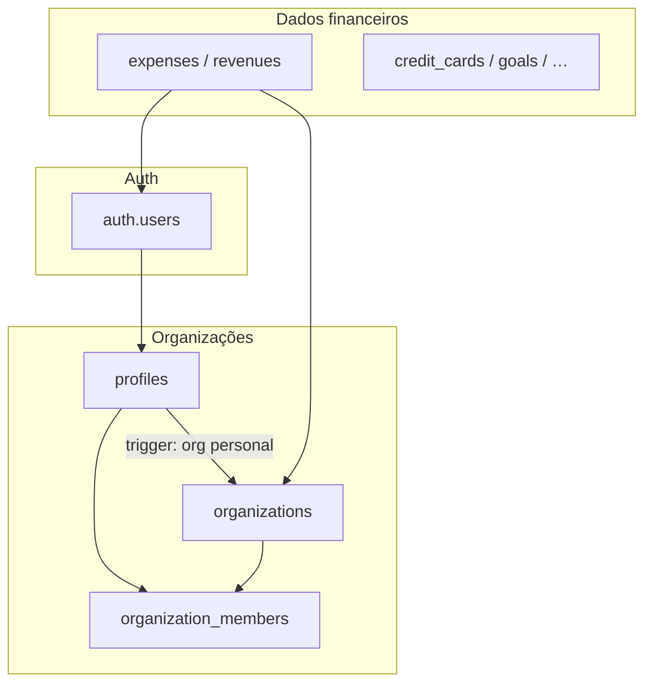

# Auditoria de Segurança — Row Level Security (RLS)

> Última revisão: maio/2026 · alinhado às migrations até `20260522150000_org_business_collaboration.sql`

## Resumo

O Alfred usa **Supabase RLS** para isolar dados entre utilizadores. Desde a migração multi-org (`20260329100000`), as entidades financeiras exigem **membership na org**. Em orgs **`business`**, todos os membros **veem** os dados da org; **editar/apagar** exige ser autor da linha ou role `owner`/`admin`. Orgs **`personal`** mantêm isolamento por `user_id`.

---

## Modelo multi-organização



| Conceito | Descrição |
|----------|-----------|
| **Org `personal`** | Criada automaticamente no registo (`trg_profiles_create_personal_org`). Uma por `owner_id`. |
| **Org `business`** | Criada pelo utilizador (`createBusinessOrganization`). Dados separados da org pessoal. |
| **Membership** | `organization_members(profile_id, organization_id, role)` — roles: `owner`, `admin`, `member`. |
| **Org ativa (UI)** | Cookie `alfred.activeOrganizationId` + `localStorage` (`OrganizationSwitcher`). Server: `resolveActiveOrganizationId()`. |

---

## Regra RLS típica (dados financeiros)

Migrations: `20260401120000`, `20260406120000`, `20260407120000`.

```sql
-- Exemplo: expenses (padrão repetido nas tabelas financeiras)
-- SELECT: org business → todos os membros; org personal → só autor
USING (public.can_view_org_row(organization_id, user_id));

-- INSERT: sempre auth.uid() = user_id + membership
WITH CHECK (auth.uid() = user_id AND public.is_org_member(organization_id));

-- UPDATE/DELETE: autor ou owner/admin em org business
USING (public.can_mutate_org_row(organization_id, user_id));
```

**Helpers:** `is_org_member`, `is_business_org`, `has_org_role`, `can_view_org_row`, `can_mutate_org_row` (`20260522150000`).

---

## Tabelas e políticas

### Dados financeiros — `user_id` + `organization_id` + membership

| Tabela | RLS | `organization_id` NOT NULL | Políticas CRUD org |
|--------|-----|------------------------------|---------------------|
| `expenses` | ✅ | ✅ | ✅ |
| `revenues` | ✅ | ✅ | ✅ |
| `subscriptions` | ✅ | ✅ | ✅ |
| `credit_cards` | ✅ | ✅ | ✅ |
| `goals` | ✅ | ✅ | ✅ |
| `income_sources` | ✅ | ✅ | ✅ |
| `projections` | ✅ | ✅ | ✅ (unique por `user_id, organization_id, month`) |

### Organizações

| Tabela | RLS | Regra principal |
|--------|-----|-----------------|
| `organizations` | ✅ | SELECT se membro; INSERT se `owner_id = auth.uid()`; UPDATE se owner |
| `organization_members` | ✅ | SELECT da própria linha (`profile_id = auth.uid()`) — evita recursão RLS |

### Perfil e admin

| Tabela | RLS | Regra principal |
|--------|-----|-----------------|
| `profiles` | ✅ | Utilizador vê/edita o próprio perfil; admins via `is_app_admin()` |
| Função `is_app_admin()` | — | `SECURITY DEFINER`, evita recursão infinita em políticas admin (`20260405120000`) |

Admins têm **SELECT global** (telemetria) em: `expenses`, `revenues`, `subscriptions`, `credit_cards`, `import_sessions`, `organizations`, `organization_members` — ver `20260328120000`, `20260405120000`.

### Importação e categorias — org scope parcial

| Tabela | `organization_id` | RLS actual | Notas |
|--------|-------------------|------------|-------|
| `import_sessions` | ✅ | ✅ NOT NULL | ✅ user_id + membership |
| `categories` | ✅ | ✅ NOT NULL | ✅ user_id + membership |

### Activity log

| Tabela | RLS | Regra |
|--------|-----|-------|
| `activity_logs` | ✅ | SELECT/INSERT só `user_id = auth.uid()`; CHECK em `action` (`20260522130000`) |

Ações válidas: `login`, `logout`, `profile_update`, `export_data`, `delete_records`, `2fa_enroll`, `2fa_unenroll`, `password_change`, `account_delete`, `settings_change`.

---

## Camada de aplicação (Next.js)

### Credenciais

- Browser/server: apenas `NEXT_PUBLIC_SUPABASE_URL` + `NEXT_PUBLIC_SUPABASE_ANON_KEY`
- **`SUPABASE_SERVICE_ROLE_KEY`**: só em cron/API server-side — nunca no cliente

### Resolução de org ativa

| Camada | Ficheiro | Comportamento |
|--------|----------|---------------|
| Server actions | `lib/activeOrganizationServer.ts` | Cookie → membership; fallback org `personal` |
| Client | `lib/activeOrganizationClient.ts` | localStorage → membership; fallback org `personal` |
| Middleware | `middleware.ts` | Auth + trial expirado; **não** valida org |

### Rotas protegidas

Middleware exige sessão em: `/dashboard`, `/expenses`, `/revenues`, `/projections`, `/reports`, `/credit-cards`, `/goals`, `/income-sources`, `/subscriptions`, `/settings`, `/profile`, `/expired`, `/import-statement`, `/import-history`, `/admin/*`.

---

## Como aplicar / verificar migrations

```bash
# Local (Docker + Supabase CLI)
supabase db push

# Validar types alinhados ao schema
npm run validate:types
```

Checklist pós-deploy:

1. Novo registo cria org `personal` + membership `owner`
2. Switcher business/personal altera dados visíveis no dashboard
3. Utilizador A **não** vê linhas de utilizador B (mesmo org business)
4. Admin vê telemetria em `/admin/dashboard`

---

## Limitações conhecidas / próximos passos

| Item | Estado | Issue roadmap |
|------|--------|---------------|
| Colaboração real (membros veem dados da org business) | ✅ `can_view_org_row` | — |
| Convites por e-mail | ✅ `organization_invites` + `/invite/[token]` | — |
| RLS `categories` / `import_sessions` por membership | ✅ `20260522140000` | — |
| Stripe / planos pagos | ❌ depende preços | Stripe pós-trial |

---

## Referência de migrations (ordem relevante)

| Migration | Conteúdo |
|-----------|----------|
| `20260218010000_rls_audit.sql` | RLS base `user_id` |
| `20260329100000_organizations_multitenant.sql` | Orgs, members, trigger personal |
| `20260401120000_expenses_revenues_organization_rls.sql` | Org em expenses/revenues |
| `20260406120000_financial_entities_organization_id_rls.sql` | Org em subs, cards, goals, income |
| `20260407120000_projections_organization_id_rls.sql` | Org em projections |
| `20260405120000_rls_is_app_admin_no_recursion.sql` | `is_app_admin()` |
| `20260522120000_advanced_features.sql` | `activity_logs`, locale/theme |
| `20260522130000_org_scope_and_activity_check.sql` | Org em import_sessions/categories; CHECK activity |
| `20260522140000_categories_import_sessions_org_rls.sql` | NOT NULL + RLS membership em categories/import_sessions |
| `20260522150000_org_business_collaboration.sql` | Helpers RLS, partilha business, convites, colegas |

---

## Revisão frontend (checklist)

- [x] Anon key no cliente; service role só server/cron
- [x] Server actions usam `createSupabaseServerClient()` (sessão do cookie)
- [x] Org ativa propagada em inserts recentes (import, categories, CRUD)
- [x] Middleware bloqueia rotas sem auth
- [ ] Testes E2E de isolamento entre utilizadores (backlog)
- [x] Migration RLS categories/import_sessions por membership (`20260522140000`)
